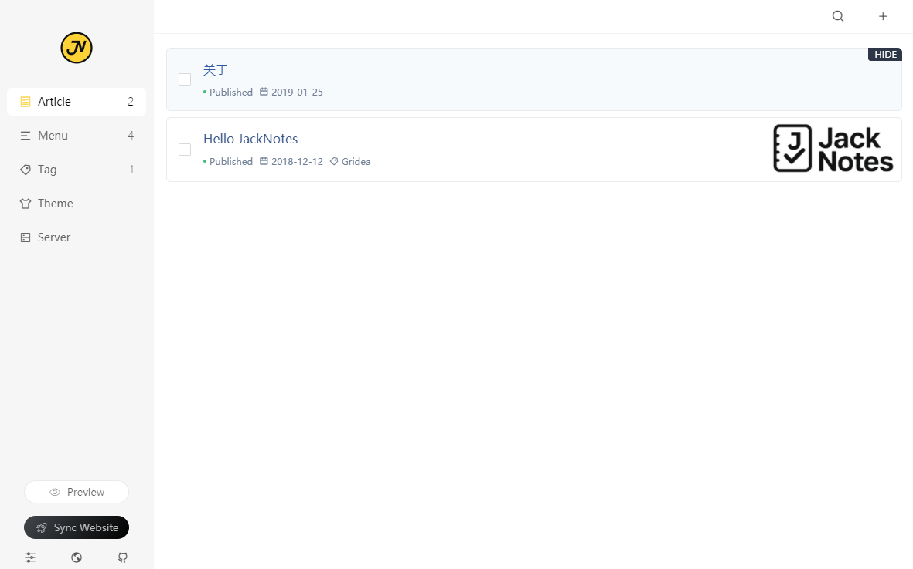
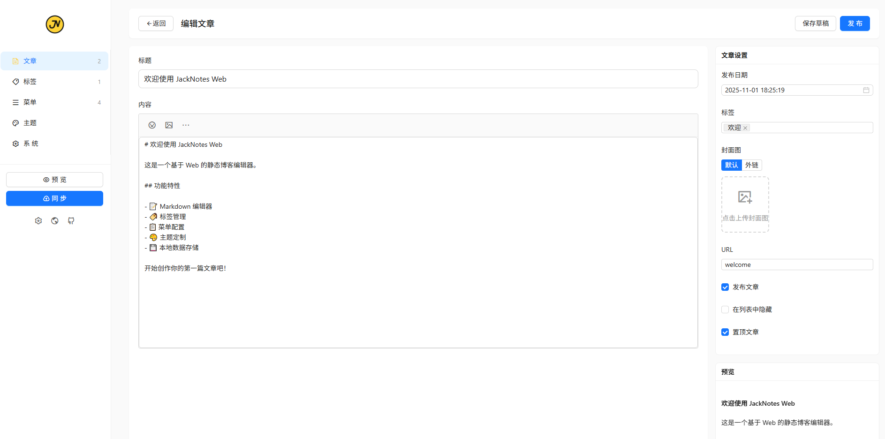

<div align="center">
  <a href="https://jacknotes.dev">
    
  </a>

  <h1 align="center">JackNotes</h1>
  <h3 align="center">A static blog writing client</h3>

   **Notice**: This project is based on Gridea (MIT License), originally developed by EryouHao.  
   It has been improved, updated under the new name JackNotes.

  [Download](https://github.com/jacksnotes/JackNotes/releases) | [Homepage](https://jacknotes.dev/)

<a href="https://github.com/jacksnotes/JackNotes/releases/latest">
  
</a>

<a href="https://github.com/jacksnotes/JackNotes/blob/main/LICENSE">
  
</a>

<a href="https://github.com/jacksnotes/JackNotes/releases/latest">
  
</a>

</div>

---

<div align="center">
  
</div>

---

English | [Русский](https://github.com/jacksnotes/JackNotes/blob/main/README-ru.md) | [简体中文](https://github.com/jacksnotes/JackNotes/blob/main/README-zh_CN.md) | [繁體中文](https://github.com/jacksnotes/JackNotes/blob/main/README-zh_TW.md)

**[CHANGELOG](https://github.com/jacksnotes/JackNotes/blob/main/CHANGELOG.md)**

👏 Welcome to use **JackNotes**！

✍️ **JackNotes** A static blog writing client. You can use it to record your life, mood, knowledge, notes and ideas...

---

## Features👇
📝 Use the coolest **Markdown** editor to create quickly

🌉 Insert pictures and article cover charts anywhere in the article

🏷️ Label and group articles

📋 Customize menus and even create external link menus

💻 Use this client on **Windows** or **MacOS** or **Linux**

🌎 Deploy to **Github Pages**, **Netlify**, **Vercel**, **Coding Pages**, **Gitee Pages**, or **SFTP**. API deployment option available to resolve network issues for some Chinese users.

💬 Simply configure and access the [Gitalk](https://github.com/gitalk/gitalk) or [DisqusJS](https://github.com/SukkaW/DisqusJS) comment system

🗺️ Use **simplified Chinese**、**traditional Chinese**、 **English**、 **Russian**、 **French**

🌁 Use any default theme within the application or any third-party theme, free theme customization

🖥 Customize the source folder and synchronize multiple devices using OneDrive, iCloud, Dropbox, etc.

🌱 Of course **JackNotes** is still very young and has many shortcomings, but please believe it will keep moving forward 🏃

In the future, it will surely become your inseparable partner

Give full play to your talents！

😘 Enjoy~

---

## Development
If you want to contribute code, please check the [Contribution Guide](https://github.com/jacksnotes/JackNotes/wiki/%E8%B4%A1%E7%8C%AE%E6%8C%87%E5%8D%97) in advance.

``` shell
$ # Node version > v10.0.0 is requied
$ git clone https://github.com/jacksnotes/JackNotes.git
$ cd JackNotes
$ yarn
$ yarn electron:serve
$ yarn electron:build
```


## Example Screenshots
<div align="center">
  
</div>


## Contributions
We welcome all contributions. You can submit any ideas as [pull requests](https://github.com/jacksnotes/JackNotes/pulls) or as GitHub [issues](https://github.com/jacksnotes/JackNotes/issues).


## License
[MIT](https://github.com/jacksnotes/JackNotes/blob/main/LICENSE). Copyright (c) 2025 JackNotes Contributors